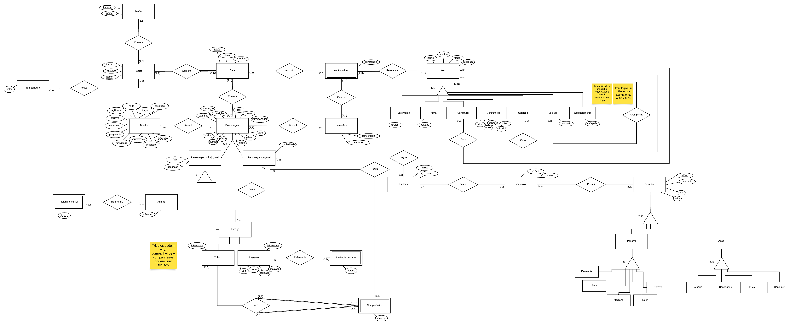
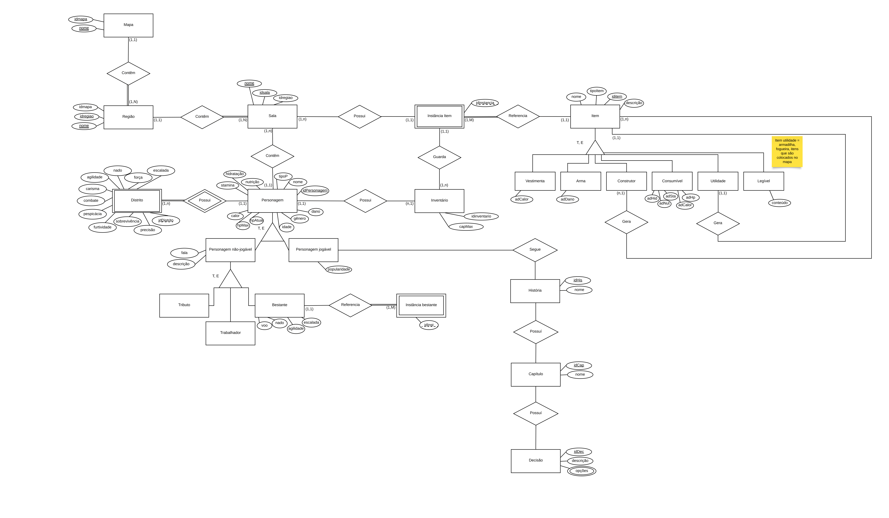

# DER

### Versionamento

| Versão | Data       | Modificação                                                                              | Autor                               |
| ------ | ---------- | ---------------------------------------------------------------------------------------- | ----------------------------------- |
| 0.0    | 19/07/2024 | Criação do Documento                                                                     | Natália Rodrigues                   |
| 1.1    | 20/07/2024 | Adição da versão 0.0 do DER                                                              | Natália Rodrigues, Gabriel Monteiro |
| 2.0    | 21/07/2024 | Adição da versão 1.1 do DER                                                              | Natália Rodrigues, Gabriel Monteiro |
| 2.1    | 22/07/2024 | Adição da versão 2.0 do DER                                                              | Natália Rodrigues, Gabriel Monteiro |
| 2.2    | 22/07/2024 | Adição da versão 2.1 do DER                                                              | Natália Rodrigues, Gabriel Monteiro |
| 2.3   | 22/07/2024 | Adição da versão 2.2 do DER                                                              | Natália Rodrigues, Gabriel Monteiro |

# Diagrama Entidade-Relacionamento (DER)

## O que é?

Um diagrama de entidade e relacionamento (ER) é uma ferramenta usada na modelagem de banco de dados para representar visualmente a estrutura de um sistema e suas relações. Ele ajuda a entender e planejar como os dados serão organizados e relacionados dentro de um banco de dados.

### Desenvolvimento do Diagrama Entidade-Relacionamento
Versões anteriores do DER:

Clique para apresentar a versão 1.1 do DER

### DER v1.1

Clique para apresentar a versão 2.0 do DER

### DER v2.0

Clique para apresentar a versão 2.1 do DER

  
### DER v2.1

Clique para apresentar a versão 2.2 do DER

  
### DER v2.2

