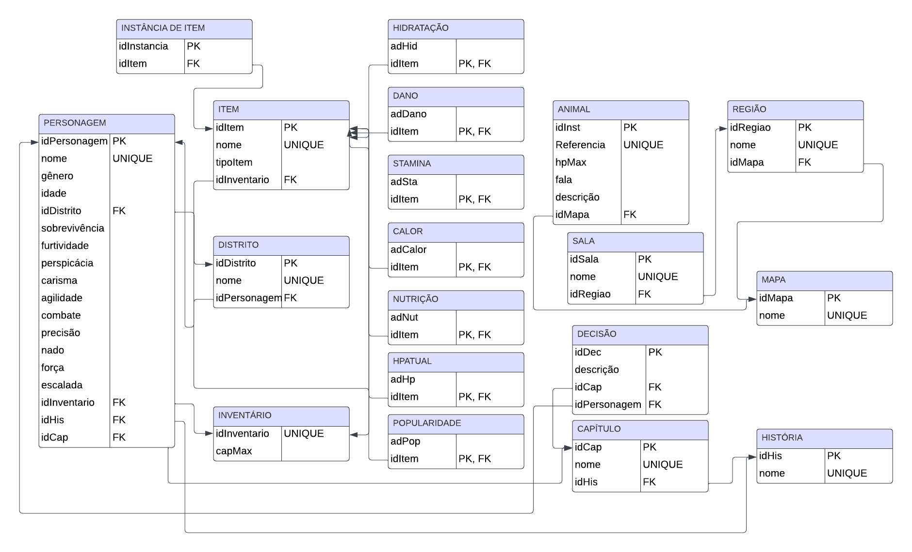

## Modelo Relacional

O modelo relacional consiste em uma forma de organização de dados de um banco de dados usando tabelas para representar os seus atributos e os relacionamentos entre estas. Segue o Modelo Relacional do jogo "The Hunger Games":

    

### Tabelas de Chaves e Relacionamentos

#### Personagem

| Campo         | Tipo   | Chave  |
|---------------|--------|--------|
| idPersonagem  | INT    | PK     |
| nome          | STRING | UNIQUE |
| gênero        | STRING |        |
| idade         | INT    |        |
| idDistrito    | INT    | FK     |
| sobrevivência | INT    |        |
| furtividade   | INT    |        |
| perspicácia   | INT    |        |
| carisma       | INT    |        |
| agilidade     | INT    |        |
| combate       | INT    |        |
| precisão      | INT    |        |
| nado          | INT    |        |
| força         | INT    |        |
| escalada      | INT    |        |
| idInventario  | INT    | FK     |
| idHis         | INT    | FK     |
| idCap         | INT    | FK     |

#### Distrito

| Campo      | Tipo   | Chave  |
|------------|--------|--------|
| idDistrito | INT    | PK     |
| nome       | STRING | UNIQUE |

#### Inventário

| Campo        | Tipo   | Chave  |
|--------------|--------|--------|
| idInventario | INT    | PK     |
| capMax       | INT    | UNIQUE |

#### Item

| Campo        | Tipo   | Chave  |
|--------------|--------|--------|
| idItem       | INT    | PK     |
| nome         | STRING | UNIQUE |
| tipoItem     | STRING |        |
| idInventario | INT    | FK     |

#### Hidratacao

| Campo        | Tipo   | Chave  |
|--------------|--------|--------|
| adHid        | INT    |        |
| idItem       | INT    | PK, FK |

#### Dano

| Campo        | Tipo   | Chave  |
|--------------|--------|--------|
| adDano       | INT    |        |
| idItem       | INT    | PK, FK |

#### Stamina

| Campo        | Tipo   | Chave  |
|--------------|--------|--------|
| adSta        | INT    |        |
| idItem       | INT    | PK, FK |

#### Calor

| Campo        | Tipo   | Chave  |
|--------------|--------|--------|
| adCalor      | INT    |        |
| idItem       | INT    | PK, FK |

#### Nutrição

| Campo        | Tipo   | Chave  |
|--------------|--------|--------|
| adNut        | INT    |        |
| idItem       | INT    | PK, FK |

#### HPAtual

| Campo        | Tipo   | Chave  |
|--------------|--------|--------|
| adHp         | INT    |        |
| idItem       | INT    | PK, FK |

#### Popularidade

| Campo        | Tipo   | Chave  |
|--------------|--------|--------|
| adPop        | INT    |        |
| idItem       | INT    | PK, FK |

#### Mapa

| Campo  | Tipo   | Chave  |
|--------|--------|--------|
| idMapa | INT    | PK     |
| nome   | STRING | UNIQUE |

#### Região

| Campo    | Tipo   | Chave  |
|----------|--------|--------|
| idRegiao | INT    | PK     |
| nome     | STRING | UNIQUE |
| idMapa   | INT    | FK     |

#### Sala

| Campo    | Tipo   | Chave  |
|----------|--------|--------|
| idSala   | INT    | PK     |
| nome     | STRING | UNIQUE |
| idRegiao | INT    | FK     |

#### Instância de Item

| Campo       | Tipo   | Chave  |
|-------------|--------|--------|
| idInstancia | INT    | PK     |
| idItem      | INT    | FK     |

#### História

| Campo | Tipo   | Chave  |
|-------|--------|--------|
| idHis | INT    | PK     |
| nome  | STRING | UNIQUE |

#### Capítulo

| Campo | Tipo   | Chave  |
|-------|--------|--------|
| idCap | INT    | PK     |
| nome  | STRING | UNIQUE |
| idHis | INT    | FK     |

#### Decisão

| Campo      | Tipo   | Chave  |
|------------|--------|--------|
| idDec      | INT    | PK     |
| descrição  | STRING |        |
| idCap      | INT    | FK     |
| idPersonagem | INT  | FK     |

#### Animal

| Campo      | Tipo   | Chave  |
|------------|--------|--------|
| idInst     | INT    | PK     |
| Referencia | STRING | UNIQUE |
| hpMax      | INT    |        |
| fala       | STRING |        |
| descrição  | STRING |        |
| idMapa     | INT    | FK     |

## Relacionamentos

### Personagem - Distrito
- **FK**: `idDistrito` em **Personagem** referenciando `idDistrito` em **Distrito**

### Personagem - Inventário
- **FK**: `idInventario` em **Personagem** referenciando `idInventario` em **Inventário**

### Personagem - História
- **FK**: `idHis` em **Personagem** referenciando `idHis` em **História**

### Personagem - Capítulo
- **FK**: `idCap` em **Personagem** referenciando `idCap` em **Capítulo**

### Inventário - Item
- **FK**: `idInventario` em **Item** referenciando `idInventario` em **Inventário**

### Mapa - Região
- **FK**: `idMapa` em **Região** referenciando `idMapa` em **Mapa**

### Região - Sala
- **FK**: `idRegiao` em **Sala** referenciando `idRegiao` em **Região**

### Instância de Item - Item
- **FK**: `idItem` em **Instância de Item** referenciando `idItem` em **Item**

### História - Capítulo
- **FK**: `idHis` em **Capítulo** referenciando `idHis` em **História**

### Capítulo - Decisão
- **FK**: `idCap` em **Decisão** referenciando `idCap` em **Capítulo**

### Decisão - Personagem
- **FK**: `idPersonagem` em **Decisão** referenciando `idPersonagem` em **Personagem**

### Animal - Mapa
- **FK**: `idMapa` em **Animal** referenciando `idMapa` em **Mapa**
